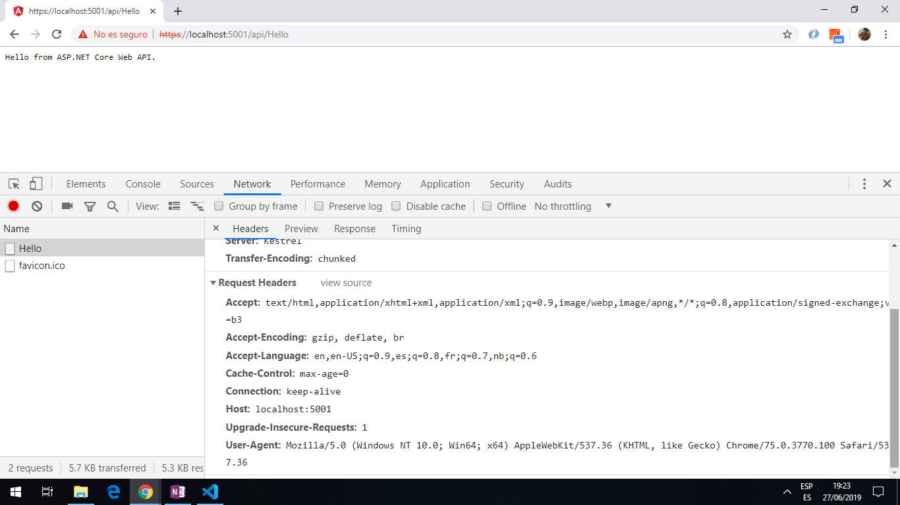

# Angular Dotnet API

[Angular 8](https://angular.io/) app with [.NET](https://dotnet.microsoft.com/) integrated to run a simple app.

*** Note: to open web links in a new window use: _ctrl+click on link_**

## Table of contents

* [General info](#general-info)
* [Screenshots](#screenshots)
* [Technologies](#technologies)
* [Setup](#setup)
* [Features](#features)
* [Status](#status)
* [Inspiration](#inspiration)
* [Contact](#contact)

## General info

* ASP.Net is an open source dev platform. It is possible to use multiple languages, editors, and libraries to build for web, mobile, desktop, gaming and IoT. .NET apps can be written in C#, F#, or Visual Basic.

* .NET Core is used here - a cross-platform .NET implementation for websites, servers, and console apps on Windows, Linux, and macOS.

## Screenshots



## Technologies

* [Angular CLI v8.0.4](https://cli.angular.io/)

* [Angular framework v8.0.1](https://angular.io/)

* [.NET Core 2.2 SDK - Windows x64 Installer v2.2.300](https://dotnet.microsoft.com/download/thank-you/dotnet-sdk-2.2.300-windows-x64-installer) compatible with VS Code 2019.

## Setup

Run `ng serve` for a dev server. Navigate to `http://localhost:4200/`. The app will automatically reload if you change any of the source files.

Run DotNet using `dotnet run` command. Navigate to `http://localhost:5000` or `https://localhost:5001`.

## Code Examples

* app.component.ts - AppService injected.

```typescript
export class AppComponent implements OnInit {
  greetings = '';

  constructor(private appService: AppService) { }

  ngOnInit(): void {
    this.appService.sayHello()
      .subscribe(
        result => {
          this.greetings = result;
        }
    );
  }
}

```

## Features

* tba

## Status & To-Do List

* Status: Working but incomplete

* To-Do: complete tutorial to add chart.js, font-awesome etc.

## Inspiration

* [MDB Angular with ASP.NET Core project](https://mdbootstrap.com/docs/angular/getting-started/net-core-integration/)

## Contact

Repo created by [ABateman](https://www.andrewbateman.org) - feel free to contact me!
